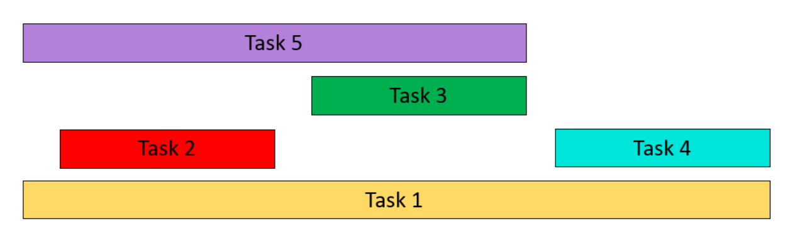

# Interval-Scheduling

## Introduction
Interval Scheduling is an optimization problem-solving method commonly used for resource scheduling or task scheduling.

## Description
Interval Scheduling is Greedy algorithm that selects as many tasks as possible without generating conflicts, given a series of tasks and their time intervals. Each task has a start and end time, and there may be conflicts or overlapping times between tasks.



## Gold
Find maximum subset of mutually compatible j

## Greedy template

### Counterexample for earliest start time


### Counterexample for shortest interval


### Counterexample for fewest conflicts


## Pseudocode

```
Interval-Scheduling(intervals):
    Sort intervals by finish time
    selected_intervals = []
    last_end_time = -∞

    for interval in intervals:
        if interval's start time ≥ last_end_time:
            Add interval to selected_intervals
            last_end_time = interval's end time

    return selected_intervals

```
### Algorithmic principle

Interval-Scheduling algorithm employs a greedy strategy, sorting intervals by finish times and iteratively selecting non-overlapping intervals with earliest finish times, ensuring maximum interval coverage without conflicts.

## Operate

- Sort the task list by end time from morning to evening.
- Initialize an empty list selected_intervals to store the selected tasks.
- Initialize the variable last_end_time to negative infinity.
- Traversing the sorted task list:
      - For each task, check if its start time is later than or equal to last_end_time:
          - If so, add the task to selected_intervals and update the last end time to the end time of the task.
          - If not, ignore the task.
- Return the selected_intervals list, which contains as many tasks as possible without conflicts.


## Algorithm implement
The Implementation of Algorithms in C++
```
int intervalSchedule(std::vector<std::vector<int>>& intervals) {
        if (intervals.empty()) return 0;
        // Sort by end time in ascending order
        std::sort(intervals.begin(), intervals.end(), [](const std::vector<int>& a, const std::vector<int>& b) {
            return a[1] < b[1];
        });
        // At least one interval is non-overlapping
        int count = 1;
        // The first interval after sorting is considered
        int x_end = intervals[0][1];
        for (const auto& interval : intervals) {
            int start = interval[0];
            if (start >= x_end) {
                // Found the next non-overlapping interval
                count++;
                x_end = interval[1];
            }
        }
        return count;
    }

```

## Time complexity
In this algorithm, the time complexity is O (n log n), where n is the number of tasks. The subsequent traversal operation is linear with a time complexity of O (n). Therefore, the time complexity of the entire algorithm is O (n log n).

## Algorithm application
The Interval Scheduling algorithm is mostly used in time management in practical life, such as airlines arranging flights and arranging takeoff and landing times reasonably to ensure sufficient time intervals between flights, while minimizing aircraft waiting time and ground congestion.
>
Alternatively, by optimizing the use of classrooms, schools can maximize the utilization of teaching resources and ensure that there are no time conflicts between courses

# Interval Partitioning

## Introduction
Interval Partitioning is a problem-solving technique used to assign a series of tasks (or activities) with start and end times to a set of resources in order to minimize the number of resources

## Description
Arrange a series of meetings in the minimum number of meeting rooms to ensure that there are no conflicts in meeting time. The key to solving this problem lies in scheduling meetings reasonably to minimize the use of conference room resources while ensuring that all meetings can be held smoothly.

## Goal
Ensure that each task is assigned to a resource and there are no conflicts between resources, i.e. the time intervals of the tasks do not overlap.


